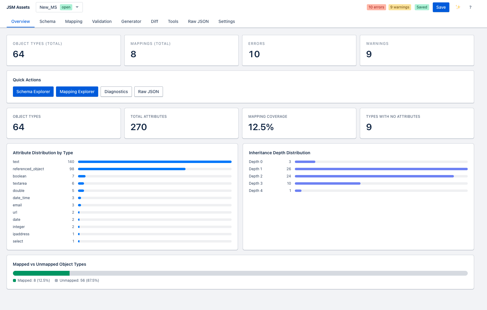

# JSM Assets Schema Designer

A production-grade web application for designing, validating, editing, diffing, and deploying Atlassian JSM Assets external import schema-and-mapping documents.

Built for teams who manage complex Assets schemas and need a professional toolchain to work with JSM's external import API — without hand-editing raw JSON.

## Features

- **Schema Explorer** — browse object types and attributes in a tree view with inheritance, cardinality, and type information
- **Mapping Explorer** — inspect object type mappings, attribute locators, and IQL expressions side-by-side with the schema
- **Raw JSON Editor** — Monaco-based editor with syntax highlighting, JSON schema validation, auto-complete, and live diagnostic squiggles
- **Validation Console** — structured diagnostics across 5 layers: parse → shape → contract → cross-reference → business rules
- **Semantic Diff** — compare two versions of a document and classify changes as breaking, safe, or informational
- **Reference Graph** — visualise object type relationships and inheritance chains
- **Stats Dashboard** — schema health at a glance: type counts, attribute coverage, mapping completeness
- **Changelog** — narrative changelog generated from schema diffs
- **Push to JSM** — push schema-and-mapping directly to Atlassian via PUT or PATCH with async progress polling
- **Bulk Tools** — bulk-add attributes, clone object types, export CSV/Markdown
- **Python Utilities** — CLI scripts for export, bulk delete, and GUID replacement

[](docs/screens/pic_12.png)

## Quick Start

```bash
npm install
npm run dev
```

Open [http://localhost:3000](http://localhost:3000).

## Run with Docker

### Docker Compose (recommended for local development)

```bash
cp .env.compose.example .env.local
docker compose up -d
```

This starts PostgreSQL + the app with persistent project storage. Open [http://localhost:3000](http://localhost:3000).

### Docker (standalone)

```bash
docker build -t jsm-schema-designer .
docker run -p 3000:3000 -v $(pwd)/projects:/app/projects jsm-schema-designer
```

See [Deployment Guide](docs/deployment.md) for production setup, reverse proxy configuration, and troubleshooting.

## Documentation

**📖 [Published Documentation Site](https://csbogdan.github.io/atlassian_assets_schema_designer/)** — Interactive product documentation with feature guides, architecture, and API reference.

Local docs in this repository:

| Document | Description |
|---|---|
| [User Guide](docs/user-guide.md) | Full feature walkthrough with screenshots descriptions |
| [Deployment Guide](docs/deployment.md) | Docker, environment variables, production setup |
| [Architecture](docs/architecture.md) | Codebase structure, domain model, state management |
| [API Reference](docs/api-reference.md) | All REST API routes exposed by the Next.js server |
| [Python Scripts](docs/scripts.md) | CLI utilities bundled with the application |
| [Validation Rules](docs/validation-rules.md) | All validation rule codes, severities, and descriptions |

## Tech Stack

- **Next.js 15** + TypeScript (strict mode)
- **Zustand** state management
- **Monaco Editor** for raw JSON editing
- **Tailwind CSS** for styling
- **Vitest** for unit tests, **Playwright** for E2E

## Test

```bash
npm test        # unit tests
npm run e2e     # Playwright E2E smoke tests
```

## License

🎉 **Internal tool, lovingly built by someone who got tired of editing Assets schemas in raw JSON at 3am.**

Use freely within Atlassian. If you're reading this from outside Atlassian and found it useful, that's honestly flattering. Please don't sue us.
