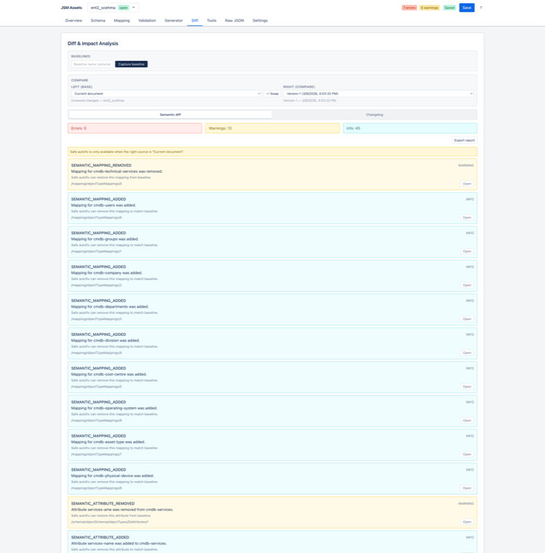
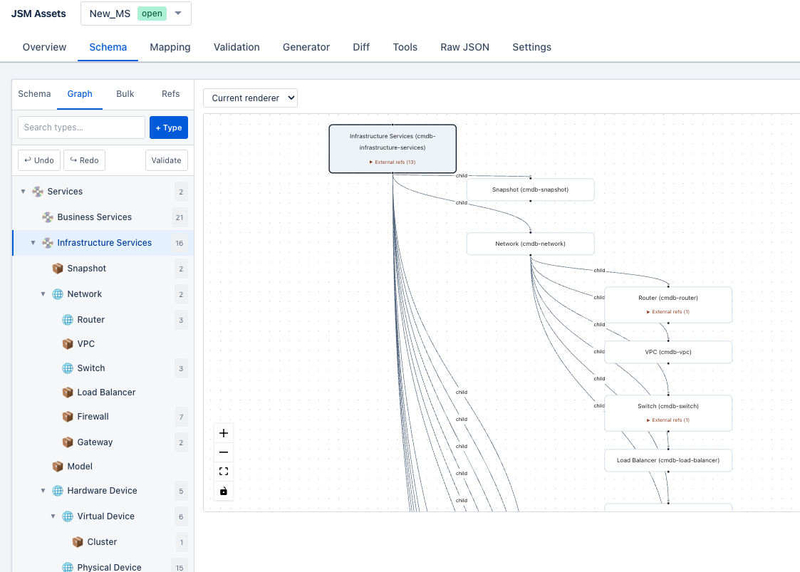
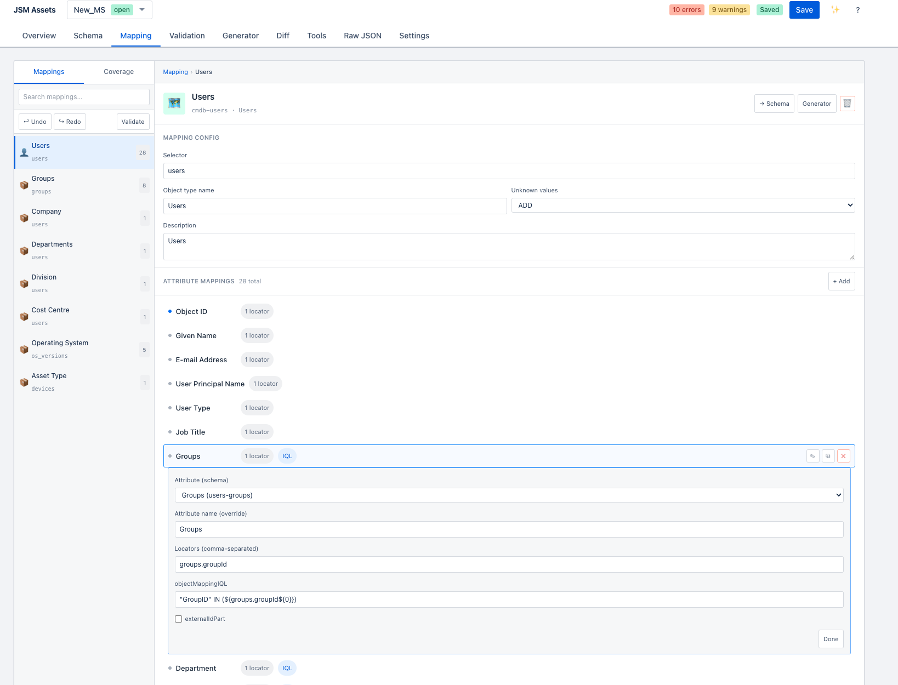
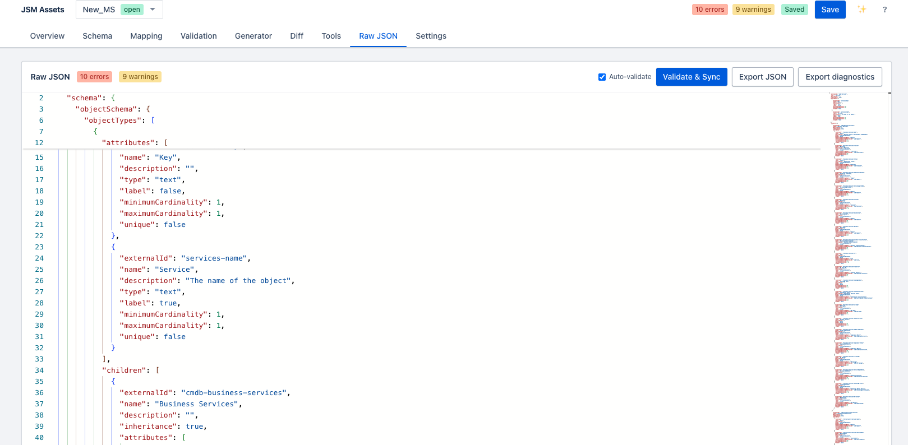
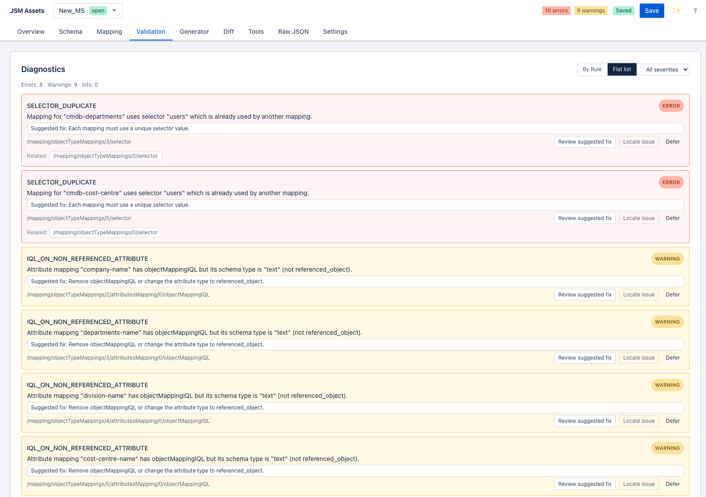
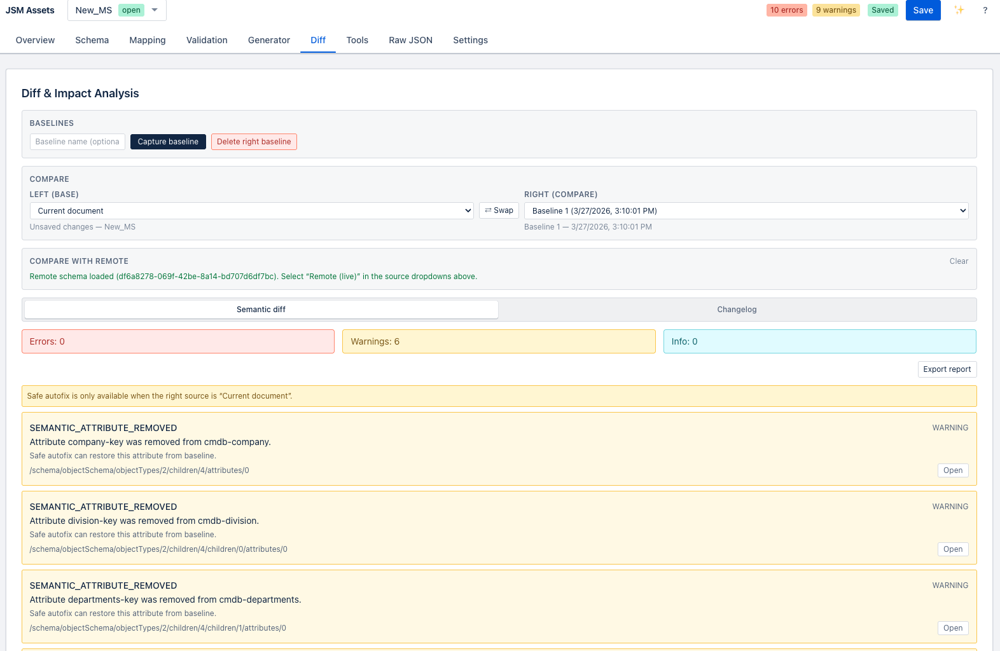
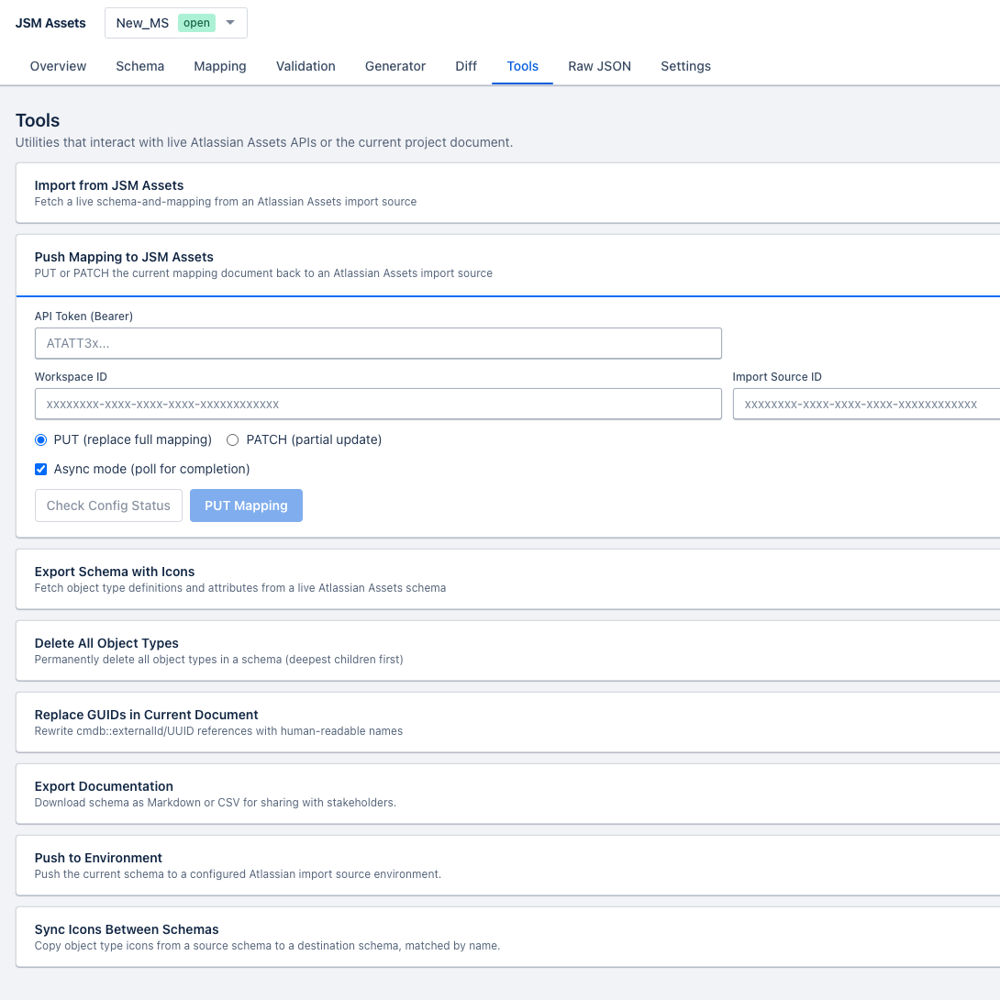
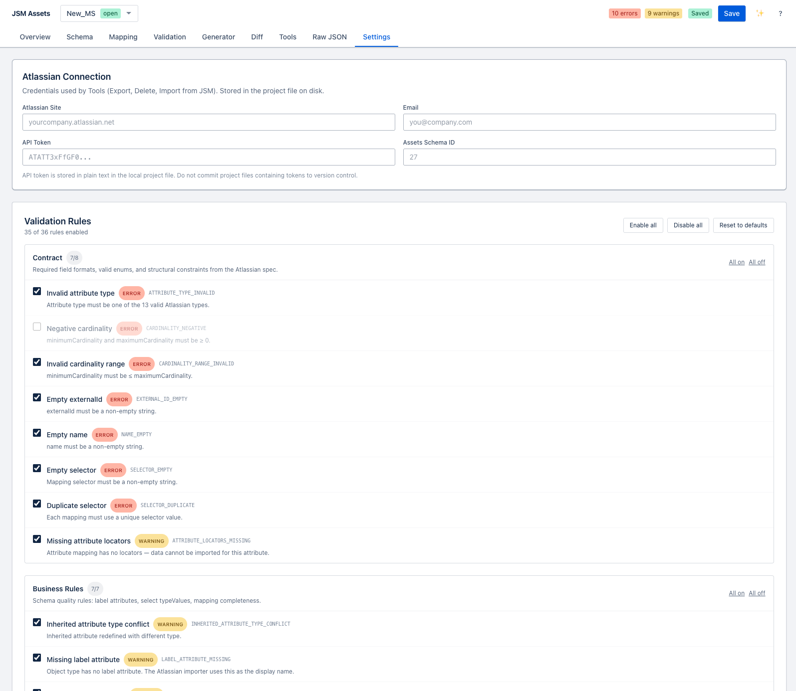

# User Guide — JSM Assets Schema Designer

## Table of Contents

1. [Overview](#overview)
2. [Getting Started](#getting-started)
3. [Projects](#projects)
4. [Loading a Document](#loading-a-document)
5. [Schema Explorer](#schema-explorer)
6. [Mapping Explorer](#mapping-explorer)
7. [Raw JSON Editor](#raw-json-editor)
8. [Validation Console](#validation-console)
9. [Semantic Diff](#semantic-diff)
10. [Reference Graph](#reference-graph)
11. [Stats Dashboard](#stats-dashboard)
12. [Search](#search)
13. [Changelog](#changelog)
14. [Tools Panel](#tools-panel)
    - [Import from JSM](#import-from-jsm)
    - [Push to JSM](#push-to-jsm)
    - [Schema Export](#schema-export)
    - [Bulk Delete](#bulk-delete)
    - [GUID Replacer](#guid-replacer)
15. [Bulk Add Attributes](#bulk-add-attributes)
16. [Keyboard Shortcuts](#keyboard-shortcuts)

---

## Overview

JSM Assets Schema Designer is a web application for working with Atlassian JSM Assets external import documents. These documents combine a **schema** (object types and attributes) with a **mapping** (rules for how source data maps to those types). The designer provides a visual environment so you can inspect, validate, edit, and deploy these documents without touching raw JSON manually.

A typical workflow looks like this:

1. Load an existing document (from disk or by pulling from the JSM API)
2. Inspect the schema and mappings visually
3. Run validation and fix any errors or warnings
4. Edit the document (via forms or raw JSON)
5. Review a semantic diff against the previous version
6. Push the updated document back to JSM

---

## Getting Started

After opening the application, you land on the **Overview** tab. This shows a summary of the currently loaded document: how many object types, attributes, and mappings it contains, plus a health indicator.

If no document is loaded, you will see a prompt to either load a project or paste JSON directly into the Raw JSON editor.

---

## Projects

Projects are named workspaces stored on disk. Each project corresponds to a single JSM import source configuration.

**Opening the Projects panel:**
Click the project name button in the top bar (e.g., "My Project ▾"). This slides down the Projects panel.

**Creating a project:**
Click **New Project** inside the Projects panel, give it a name, and confirm.

**Switching projects:**
Click any project name in the list. The panel closes automatically and the selected project loads.

**Deleting a project:**
Click the trash icon next to the project name. You will be asked to confirm.

**Closing the panel:**
Click **✕ Close** at the top right of the panel.

Projects persist across browser sessions. If you hard-refresh the browser, the last active project is restored automatically.

---

## Loading a Document

There are three ways to load a document:

### Paste JSON

1. Go to the **Raw JSON** tab.
2. Paste your document JSON into the Monaco editor.
3. Click **Validate & Sync** (or wait ~700 ms for auto-validate to fire).
4. The document populates all other views.

### Import from JSM

Use the Tools panel → **Import from JSM**:

1. Enter your Atlassian cloud domain (e.g., `mycompany.atlassian.net`)
2. Enter your API token (Atlassian personal access token)
3. Enter your workspace ID and import source ID
   _(These can be extracted automatically from a JSM import source URL — paste the URL and click **Parse**)_
4. Click **Fetch schema and mapping**.
5. The document loads into the current project.

### Open from disk

If running via Docker with a mounted volume, place your JSON file in `/app/projects/<project-name>/document.json`. It will appear in the Projects panel on next page load.

---

## Schema Explorer

The Schema Explorer renders the object type hierarchy as a collapsible tree.

**Features:**
- **Expand/collapse** object type nodes to reveal children and attributes
- Each attribute row shows: name, type, cardinality (`min..max`), and flags (Label, Unique)
- Object types with `inheritance: true` are marked with an inheritance badge
- `referenced_object` attributes show the target object type name
- Click **Locate in JSON** on any node to jump to it in the Raw JSON editor with the relevant range highlighted

**Reading cardinality:**
- `0..1` — optional, at most one value
- `1..1` — required, exactly one value
- `0..-1` — optional, unlimited values
- `1..-1` — required, at least one value

**Switching to Graph view:**
Use the **Tree / Graph** toggle in the Schema toolbar to switch to the hierarchy graph. The graph shows inheritance relationships as a node-link diagram.

---

## Mapping Explorer

The Mapping Explorer shows each object type mapping alongside the corresponding schema definition.

**Layout:**
- Left column: object type name, selector (JQL or CSV query), `unknownValues` policy
- Right column: attribute mappings table with columns: attribute name, type, locators, `externalIdPart`, and `objectMappingIQL`

**Reading the mapping:**
- **Selector** — the JQL query or CSV file pattern that identifies source records for this object type
- **Locators** — the source field names (or expressions) that provide the attribute value
- **externalIdPart** — if checked, this attribute contributes to the generated external ID of the asset
- **objectMappingIQL** — for `referenced_object` attributes, the IQL expression that resolves the referenced asset

**Filters:**
Use the search box at the top to filter object types by name. Mappings that contain errors are highlighted in red.

---

## Raw JSON Editor

The Raw JSON tab hosts a full Monaco editor instance with:

- **Syntax highlighting** (JSON)
- **JSON Schema validation** — the editor knows the full schema for JSM import documents and highlights structural errors inline
- **Auto-complete** — press `Ctrl+Space` inside any object to see valid property suggestions
- **Bracket pair colorization** and **indent guides**
- **Minimap** for quick navigation

**Toolbar buttons:**
- **Auto-validate** checkbox — when enabled, every edit triggers domain validation after a 700 ms debounce
- **Validate & Sync** — force-run validation and sync the parsed document to all views
- **Export JSON** — download the current document as `assets-schema-document.json`
- **Export diagnostics** — download the current diagnostic list as JSON

**Navigation from other panels:**
Clicking "Locate in JSON" in the Schema Explorer or Validation Console highlights the relevant section in the editor and scrolls it into view.

---

## Validation Console

The Validation Console runs five layers of validation in sequence:

| Layer | What it checks |
|---|---|
| **Parse** | Is the input valid JSON? |
| **Shape** | Does the top-level structure match the expected shape? |
| **Contract** | Are required fields present? Are field names cased correctly per the Atlassian spec? |
| **Cross-reference** | Do all mapping `objectTypeExternalId` and `attributeExternalId` values match actual schema IDs? |
| **Business rules** | Duplicates, missing labels, suspicious cardinalities, incomplete mappings, circular references, inheritance conflicts |

Each diagnostic has:
- **Severity**: `error` (red) / `warning` (amber) / `info` (blue)
- **Code**: a short string like `DUPLICATE_OBJECT_TYPE_ID` for programmatic reference
- **Message**: human-readable description
- **Path**: JSON Pointer to the offending location
- **Suggestion**: how to fix it (when available)

Click any diagnostic row to jump to it in the Raw JSON editor.

---

## Semantic Diff

The Diff panel compares two versions of a document.

**To compare:**
1. Load a "before" document in the **Baseline** slot (paste JSON or load a file)
2. The current document is used as the "after"
3. The diff is computed automatically

**Change classification:**
- **Breaking** — changes that will cause import failures or data loss (e.g., removed required attribute, changed type)
- **Safe** — additive changes with no impact on existing assets (e.g., new optional attribute)
- **Info** — name or description changes, cosmetic edits

Each change shows the JSON Pointer path, the old value, and the new value.

---

## Reference Graph

The Schema tab has a graph view accessible via the **Graph** toggle in the toolbar:

**Schema Graph** — shows object type hierarchy with inheritance relationships and dependencies. Nodes represent object types; edges show child and reference relationships.

**Interacting with the graph:**
- **Scroll** to zoom in/out
- **Drag** to pan
- **Click a node** to select it — the right panel shows the type's details and attributes; outgoing and incoming reference edges are highlighted in blue and red respectively
- **Isolate selection** — focus the graph on the selected node and its immediate neighbours
- **Fit to view** — reset zoom to show all nodes
- **Line style** — toggle between Curved and Straight edges

**Toolbar filters (reference graph):**
- **Selected** — highlights the currently selected type
- **Outgoing refs** — count of `referenced_object` attributes pointing outward
- **Incoming used-by** — count of other types that reference this type

---

## Stats Dashboard

The Stats Dashboard provides a quick health check:

| Metric | Description |
|---|---|
| Object types | Total count (including children) |
| Attributes | Total across all types |
| Avg attributes / type | Indicates schema density |
| Referenced object attrs | How many cross-references exist |
| Mapped types | Object types that have a mapping entry |
| Mapping completeness | % of schema attributes covered by mappings |
| Errors / Warnings | Current diagnostic counts |

---

## Search

The Search tab lets you search across the entire document:

- Type any keyword to search object type names, attribute names, descriptions, and mapping selectors
- Results group by category (Object Types, Attributes, Mappings)
- Click a result to navigate to it in the relevant explorer view

---

## Changelog

The Changelog tab generates a narrative description of changes between two document versions. It summarises:

The Changelog tab generates a narrative description of changes between two document versions. It summarises:

- New or removed object types
- Renamed types or attributes
- Type or cardinality changes on attributes
- Mapping selector changes

This is useful for writing release notes or communicating changes to stakeholders.

---

## Tools Panel

The Tools tab consolidates operational actions that interact with JSM's APIs or perform bulk operations.

### Import from JSM

Pulls the current schema-and-mapping from a JSM import source.

**Required inputs:**
- **Cloud domain** — your Atlassian site domain (e.g., `mycompany.atlassian.net`)
- **API token** — Atlassian personal access token with `import:import-configuration:cmdb` scope
- **Workspace ID** — your JSM Assets workspace ID
- **Import source ID** — the ID of the import source to fetch

**Tip:** If you have a URL from the JSM import source settings page, paste it into the URL field and click **Parse** to extract the workspace and import source IDs automatically.

### Push to JSM

Pushes the current document to JSM.

**Required inputs:** same as Import.

**Options:**
- **Method**: PUT (full replace) or PATCH (partial update)
- **Async**: if enabled, the push runs as a background job; the tool polls every 3 seconds until complete

**PUT vs PATCH:**
- Use **PUT** when you want to fully replace the mapping configuration (safe for initial deployment)
- Use **PATCH** when you are making incremental updates and want JSM to merge changes

### Schema Export

Downloads the current document as a JSON file or copies it to the clipboard. Useful for backup or for sharing with team members.

### Bulk Delete

Runs the `fast_delete_assets_object_types.py` Python script to delete a batch of object types from JSM. This is a destructive operation — use with care.

Requires the same credentials as Import/Push.

### GUID Replacer

Runs the `guid_replacer.py` script to replace auto-generated GUIDs (`cmdb::externalId` values) in a document with human-readable names derived from the object type and attribute names.

**Use case:** When you export a schema from JSM, all external IDs are GUIDs. This tool rewrites them so the document is easier to read and maintain.

---

## Bulk Add Attributes

Available from the **Schema** tab → **Bulk Add Attributes** button.

Add the same attribute(s) to multiple object types in one operation:

1. Select the target object types (checkboxes in the list)
2. Fill in the attribute fields:
   - Name
   - External ID
   - Type (text, integer, boolean, referenced_object, etc.)
   - For `referenced_object`: select the target object type from the dropdown
   - Cardinality (min/max)
   - Optional: mark as Label, Unique
3. Click **Add to selected types**

The document updates immediately and the Raw JSON editor reflects the change.

---

## Settings

The **Settings** tab has two sections:

**Atlassian Connection** — store your API credentials (cloud domain, email, API token, workspace ID, import source ID) per project. These are saved to disk alongside the project document and pre-filled in the Tools panel.

**Validation Rules** — enable or disable individual validation rules per project, grouped by category (Contract, Business Rules, Cross-Reference, Impact Analysis, Semantic Diff). Each rule shows its code, a description, and its default severity. Disabled rules are skipped during validation and will not appear in the diagnostics console.

---

## Keyboard Shortcuts

Press `?` in the top bar to see the full shortcut reference. Key bindings:

| Shortcut | Action |
|---|---|
| `1` – `9` | Switch to tab 1–9 |
| `P` | Open Projects panel |
| `S` | Save current project |
| `Ctrl+Z` | Undo |
| `Ctrl+Shift+Z` | Redo |
| `Ctrl+K` | Focus search |
| `Escape` | Close modal / panel |
